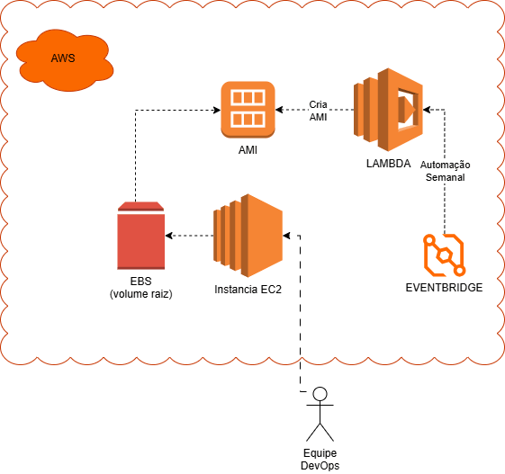
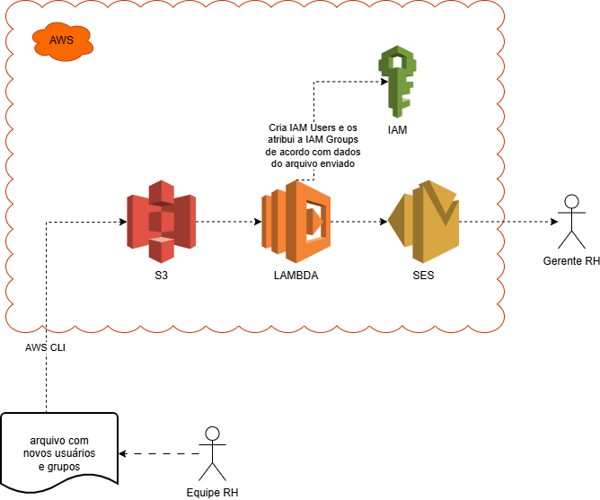

# ☁️ Automações AWS — Criação de AMI e Criação de Usuários IAM

Este repositório reúne **duas automações completas em AWS**, cada uma demonstrando um caso real de uso de serviços serverless, infraestrutura imutável e governança de identidade.

Para essas automações utilizamos essencialmente os seguintes recursos AWS: **EC2**, **EBS**, **S3**, **LAMBDA**, **IAM**, **AMI** e **Eventbridge**

Para melhor visualização da arquitetura, foi utilizando o software **Drawio**

Os projetos foram desenvolvidos com foco em **boas práticas**, **segurança**, **escalabilidade** e **automação operacional**.

---

# 🟧 Projeto 1 — Automação de Criação de AMI (EC2 + Lambda + EventBridge)

## 📌 Descrição
Este projeto automatiza a criação semanal de **AMIs (Amazon Machine Images)** a partir de uma instância EC2 configurada.  
A automação permite recriar instâncias idênticas, manter ambientes padronizados e seguir práticas de infraestrutura imutável.

---

## 🎥 Arquitetura — AMI Automation

---

## 🔁 Fluxo da Automação

1. A equipe DevOps configura a EC2 com o ambiente desejado.  
2. O EventBridge dispara a Lambda semanalmente.  
3. A Lambda cria uma nova AMI usando `CreateImage`.  
4. (Opcional) AMIs antigas são removidas para manter o ambiente limpo.  
5. A AMI fica disponível para recriação de instâncias.

---

## 🛠️ Tecnologias Utilizadas

- Amazon EC2  
- Amazon EBS  
- Amazon Machine Image (AMI)  
- AWS Lambda  
- Amazon EventBridge  
- AWS IAM  

---

## 🔐 Permissões Necessárias (IAM Role da Lambda)

- `ec2:CreateImage`  
- `ec2:DescribeInstances`  
- `ec2:DeregisterImage` (opcional)  
- `ec2:DeleteSnapshot` (opcional)  

---

# 🟦 Projeto 2 — Automação de Criação de Usuários IAM (S3 + Lambda + SES)

## 📌 Descrição
Este projeto automatiza o processo de criação de **usuários IAM** e associação a grupos com base em um arquivo enviado pela equipe de RH.  
A solução reduz erros manuais e garante governança e rastreabilidade.

---

## 🎥 Arquitetura — IAM Automation

---

## 🔁 Fluxo da Automação

1. O RH envia um arquivo CSV/JSON para o S3 via AWS CLI.  
2. O S3 aciona automaticamente a Lambda.  
3. A Lambda:
   - lê o arquivo  
   - cria usuários IAM  
   - adiciona aos grupos  
   - envia notificação via SES  
4. O gerente de RH recebe um e-mail com o resumo da operação.

---

## 🛠️ Tecnologias Utilizadas

- Amazon S3  
- AWS Lambda  
- AWS IAM  
- Amazon SES  
- AWS CLI  

---

## 🔐 Permissões Necessárias (IAM Role da Lambda)

- `iam:CreateUser`  
- `iam:AddUserToGroup`  
- `iam:CreateLoginProfile`  
- `iam:ListGroups`  
- `ses:SendEmail`  

---

